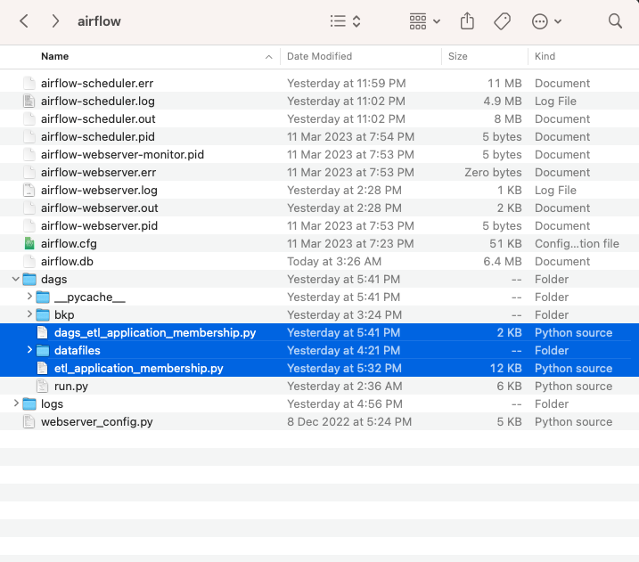

# GovTech - Data Engineering Tech Challenge
 

## Introduction 
This repository holds:
    - codes and necessary documents for each assesment sections
 
## Section 1 - Data Pipeline

### Code Folder: "section_1_data_pipeline"
### Getting Started
To get started on your local you need to setup a Python `virtualenv` by following the below instructions:

#### 1.	Installation process

- 1.1. Setup Python Virtual Environment
Create a Python Virtual environment ([refer to this link](https://docs.python.org/3/library/venv.html)).

Run the following commands to set the virtual environment and install Python dependencies

```bash
# Create virtual environment
python -m venv <path to virtual environment>

# Activate virtual environment (note: the activate script may be in another location within the venv)
source <path to virtual environment>/bin/activate

# Install python dependencies
pip install -r section_1_data_pipeline/requirements.txt
```
- 1.2. working location 
  - All the data files/folders are created or copied to the airlfow installation directory. 
  - Before running your data below value in "section_1_data_pipeline/dags/etl_application_membership.py" should be udpated 
    - raw_path = "/Users/santhoshjanakiraman/airflow/dags/datafiles/raw/"
    - stage_path = "/Users/santhoshjanakiraman/airflow/dags/datafiles/stage"
    - input_path = "/Users/santhoshjanakiraman/airflow/dags/datafiles/input"
  - copy below py files from "section_1_data_pipeline" tp the airflow directory, for the dags to the picked up
    - dags_etl_application_membership.py
    - etl_application_membership.py
  - screenshot

  
    
## Section @ - Database
