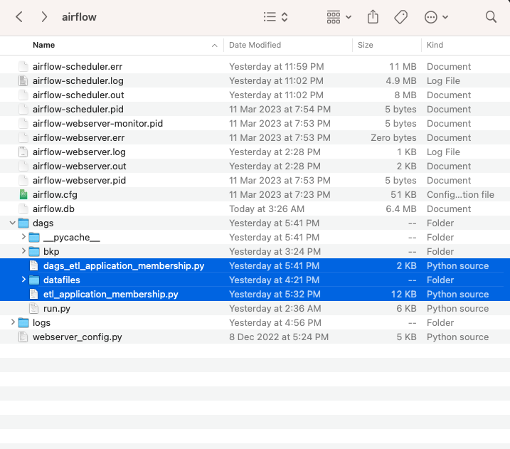

# SECTION 1 - DATA PIPELINE

## Requirement

1. set up a pipeline to ingest, clean, perform validity checks, and create membership IDs for successful applications. 
   - An application is successful based on below 
      - validaions
        - Application mobile number is 8 digit
        - Applicant is over 18 years old as of 1 Jan 2022
        - Applicant has a valid email (email ends with @emailprovider.com or @emailprovider.net)
      - Funcatioal Requirements
        - Split name into first_name and last_name
        - - Format birthday field into YYYYMMDD
        - - Remove any rows which do not have a name field (treat this as unsuccessful applications)
        - - Create a new field named above_18 based on the applicant's birthday
        - - Membership IDs for successful applications should be the user's last name, followed by a SHA256 hash of the applicant's birthday, truncated to first 5 digits of hash (i.e <last_name>_<hash(YYYYMMDD)>)
2.  Output the successful applications into a folder, 
3.  Unsuccessful applications should be condolidated and dropped into a separate folder.
4.  use common scheduling solutions such as cron or airflow to implement the scheduling component. 

***

## Implementation Details

### Code Folder: "section_1_data_pipeline"
### Getting Started
To get started on your local you need to setup a Python `virtualenv` by following the below instructions:

#### 1.	Installation process

- 1.1. Setup Python Virtual Environment
Create a Python Virtual environment ([refer to this link](https://docs.python.org/3/library/venv.html)).

Run the following commands to set the virtual environment and install Python dependencies

```bash
# Create virtual environment
python -m venv <path to virtual environment>

# Activate virtual environment (note: the activate script may be in another location within the venv)
source <path to virtual environment>/bin/activate

# Install python dependencies
pip install -r section_1_data_pipeline/requirements.txt
```
- 1.2. working location 
  - All the data files/folders are created or copied to the airlfow installation directory. 
  - Before running your data below value in "section_1_data_pipeline/dags/etl_application_membership.py" should be udpated 
    - raw_path = "/Users/santhoshjanakiraman/airflow/dags/datafiles/raw/"
    - stage_path = "/Users/santhoshjanakiraman/airflow/dags/datafiles/stage"
    - input_path = "/Users/santhoshjanakiraman/airflow/dags/datafiles/input"
  - copy below py files from "section_1_data_pipeline" tp the airflow directory, for the dags to the picked up
    - dags_etl_application_membership.py
    - etl_application_membership.py
  - screenshot

 

### Pipelnie Task Details

  1. created pipeline task in spark (pyspark) to validate the given records and generate final datasets
     - Dataset 1 : Valid memerbship list, as per the details given in requirement
       - File Path: 
            [Successful Applications](/section_1_data_pipeline/datafiles/stage/20230312_17/successful_applications/part-00000-975bb8b3-f1b7-4e06-a07d-d818373b8cb8-c000.csv)

     - Dataset 2 : Error records. The list includes the error detils in the column comments
       - File Path: 
            [Error Records](/section_1_data_pipeline/datafiles/stage/20230312_17/error_records/part-00000-75a049a1-fb0b-4ab9-8831-60abf760e795-c000.csv)
            
  2. create dags 
     - Create a dag to excure below task
     - Copy sources file to Raw Folder
        - Copy the file from the input folder (assuming this is the source location that will receive the files ) to raw
        - In raw folder create a subfolder with runId (runId is the date time in "yyyyMMdd_HH" format)
        - Paste the copied files from input folder to raw/<runId> folder
        - Remove the files in Input folder, to avoid processing the files again in next run
      - Validate and Transform input data
        - Load files in raw folder to a dataframe
        - Execute below validations
          - Validate Mobile number
          - Validate dob
          - Validate email address
        - Fucntional Requirements
          - Calculate Age
          - Split full name in to first and last name
        - Prepare final data set
        - Write the result dataframt to stage folder
    - Note: if there is any aggregations or calculations, then those will be perormed and moved to processed folder. As Ther are no such requirement, this folder will be empty for now. 