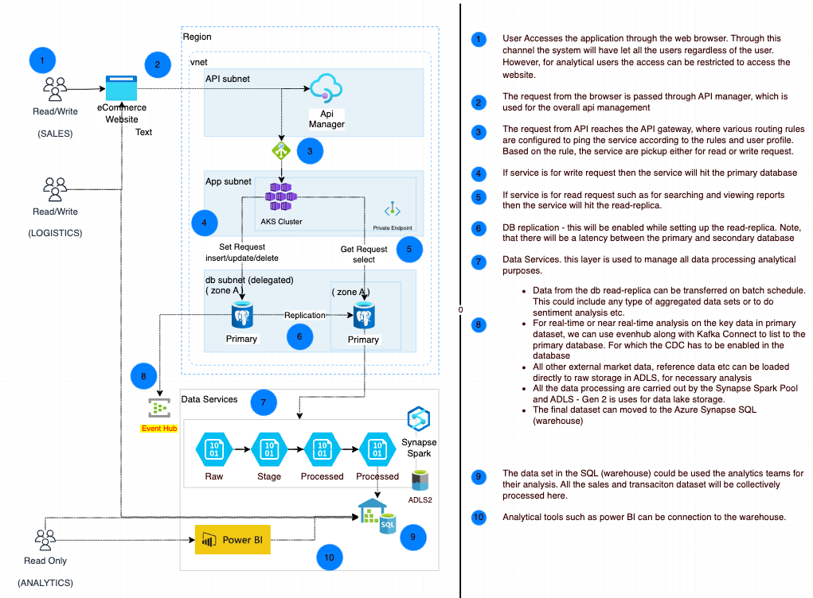
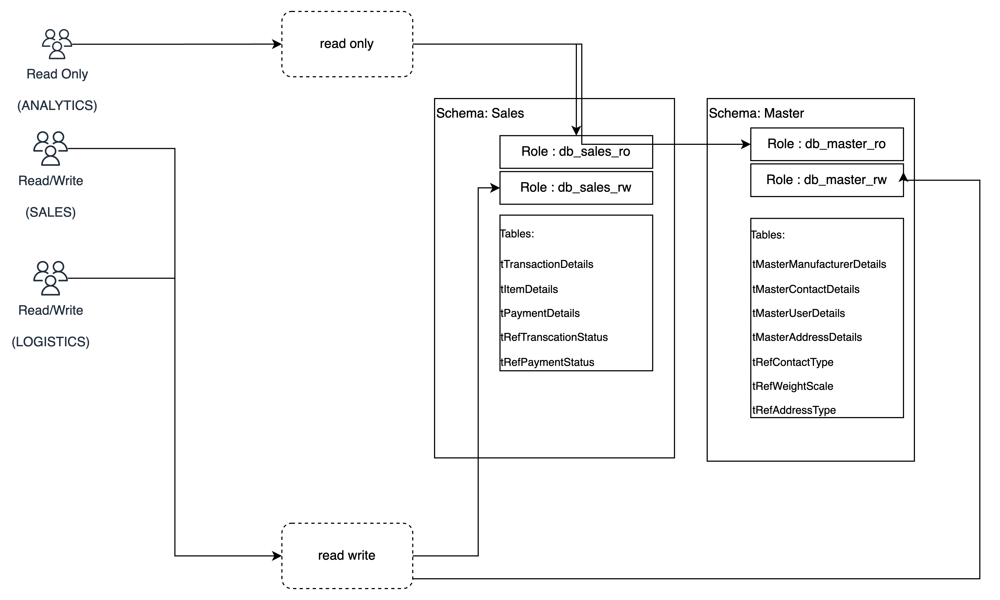

# SECTION 3 - SYSTEM DESIGN [DESIGN - 1]
## Requirement

1. Design database layer to handle request by below teams : 
   - Logistics: 
      - Get the sales details (in particular the weight of the total items bought)
      - Update the table for completed transactions
   - Analytics:
      - Perform analysis on the sales and membership status
      - Should not be able to perform updates on any tables
   - Sales:
      - Update databse with new items
      - Remove old items from database

*** 

## Implementation Details

### System Architecture

[Source draw.io file](/section_3_system_design/design_1/design_1.drawio)

  

### Desigm Details 

1. Infra Components Overview:
   - DB Read Replica:
     - As per the requires in task 2, we will be using Azure postrgres database (flexiserver), as it is a fully managed service provided by Azure.
     - As we need to handle HA and workload for various senarios involves, relative amoung of read-only access by multiple teams, it is highly recommend to create atleast 2 read-replicas in same zone.
     - Consdieration - to enable cross region replicat to handle disaster recovery
   - Networking:
     - In our case all our services will be in same region, assuming that the user base is in one region. 
     - postgres flexiserver will be able to connecto only if the request is from the same region and hence the incoming conection will be secured
     - All the azure manged services are handled via the privatelink/private endpoint, few of these services used in this scenario are
       -  eventhub
       -  adls storage 
      - In current senario, we do not have any v-net peering. However, if we have multiple subscriptions/vnets to handle such as landing-zone, devops ets, then those has to be peered accordingly.
    - Api Manager
      - Assuming that the application is using microservices, we would need to hava the api manager to handle the incomeing request. 
    - Application Gateway:   
      - Azure Application Gateway helpts to manage traffic
      - Routing by applicaiton gateway is made based on the request and hence the service call can be made to the corresponding service in the kubernets cluster
    - Kubernetes
      - as in our case we using Azure cloud, we will be using Azure Kubernets Cluster. 
      - The cluster will be used to manage all application services (front-end and backend) and also data processing services
      - The request fromt he applicaiton gateaways reaches the particular service and from there calls any of the below
        - postregress primary db for any transactional services, which needs read and write access
        - postgres read-replicat for any read-only access such as search, reports etc.
        - Note: the read replicate will have some latency which ideally would be few minutes. Assuming this is acceptable
    - Storage Account:
      - ADLS gen2 is used for 
    - Data Services :
      - Synapse Analytics - 
        - to process all raw data from external source and transcational system
        - generate more insight full data needed by other teams
        - data workload will be processed by synapse spark pool
        - final processed data will be stored in Azure SQL for access by user and dashboard tools
    - Eventhub.
      - We have considered Eventhub, in order to stream some key metrices or critical data from the transcational to the warehouse for further analysis
      - inorder to achieve the neear real time data, CDC should be enabled in the primary database. Kafka connect should pull the data from the source and push it to the ADLS
  - 

      
## Design access based on DB level RBAC

 

- The tables in the database can be grouped under the schema's based on the fucntional use case
- The should be 2 set's of roles per schema 
  - role 1 : read write role to insert, updated, delete all tables in the schema
  - role 2 : read only role to select the records
- The users should be assinged to these roles based on the requirment
  - in our case
    - Sales and logistics team will be granted the read and write role for all schema
    - Anlayitcs team will be granted the read only rolw for all the schemas
    - In there are any who dont need access to particutlar schma, that could be blocked as well., as the role created will be at schema level
    - for drop access, it is recommende to create an role with ownership access per schema and also a common rolt to an admin. This is essential to maintain the principle of lease prvilatges and any data loss will be more accountable. 
