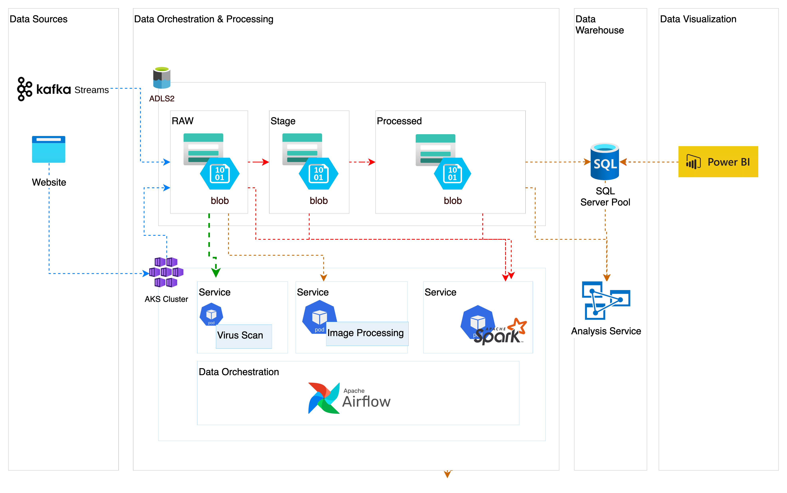

# SECTION 3 - SYSTEM DESIGN [DESIGN - 1]
## Requirement

produce a system architecture diagram (Visio, PowerPoint, draw.io) depicting the end-to-end flow  for 

-   Design data infrastructure on the cloud for a company whose main business is in processing images.The use cases to be considered are
    -   web application which allows users to upload images to the cloud using an API. 
    -   web application which hosts a Kafka stream that uploads images to the same cloud environment (Note: This Kafka stream has to be managed by the company's engineers)
    -   Business Intelligence resource where the company's analysts can access and perform analytical computation on the data store
    -   Other Considerations
        - Securing access to the environment and its resources as the company expands
        - Security of data at rest and in transit
        - Scaling to meet user demand while keeping costs low
        - Maintainance of the environment and assets (including processing scripts)
  - Design consdierations
      - Managability
      - Scalability
      - Secure
      - High Availability
      - Elastic
      - Fault Tolerant and Disaster Recovery
      - Efficient
      - Low Latency
      - Least Privilege

Do indicate any assumptions you have made regarding the architecture. You are required to provide a detailed explanation on the diagram.
*** 

## Design Details

### System Architecture

High Level Architecture

 

Data Pipeline 

 

