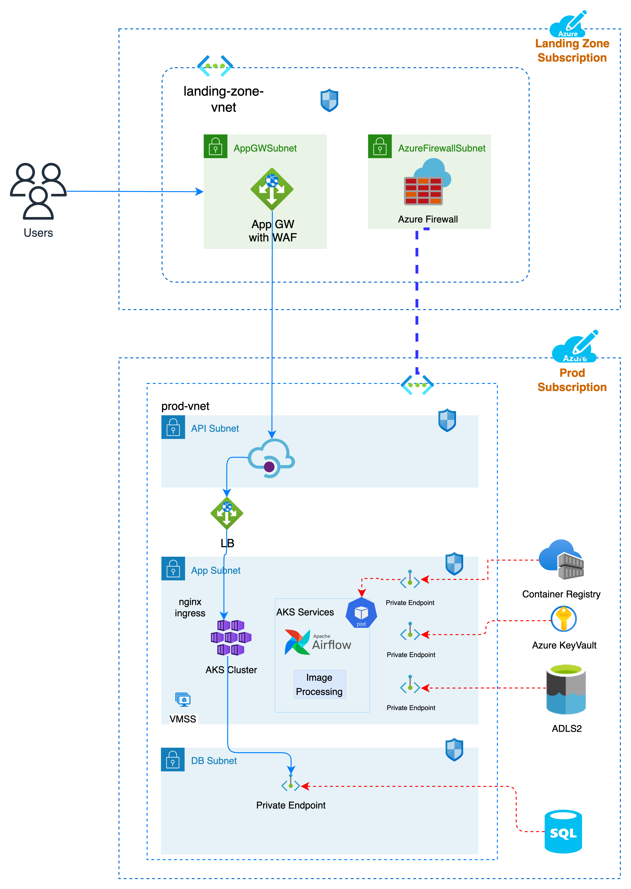
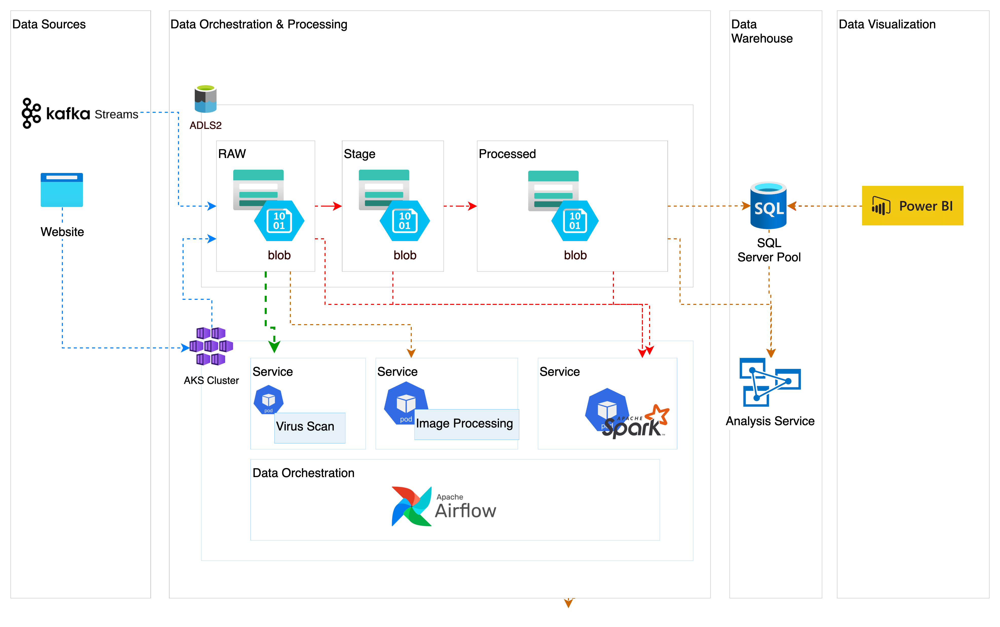

# SECTION 3 - SYSTEM DESIGN [DESIGN - 1]
## Requirement

produce a system architecture diagram (Visio, PowerPoint, draw.io) depicting the end-to-end flow  for 

-   Design data infrastructure on the cloud for a company whose main business is in processing images.The use cases to be considered are
    -   web application which allows users to upload images to the cloud using an API. 
    -   web application which hosts a Kafka stream that uploads images to the same cloud environment (Note: This Kafka stream has to be managed by the company's engineers)
    -   Business Intelligence resource where the company's analysts can access and perform analytical computation on the data store
    -   Other Considerations
        - Securing access to the environment and its resources as the company expands
        - Security of data at rest and in transit
        - Scaling to meet user demand while keeping costs low
        - Maintainance of the environment and assets (including processing scripts)
  - Design consdierations
      - Managability
      - Scalability
      - Secure
      - High Availability
      - Elastic
      - Fault Tolerant and Disaster Recovery
      - Efficient
      - Low Latency
      - Least Privilege

## Assumptions

- Desigion Only for PROD environment 
- Other enviroument such as Devops, non-prod, pre-prod are out of scope
- 
## Design Details

### System Architecture

High Level Architecture

- Lading Zone Subscription
  - All the incoming traffic from the external source will be thoguth the landing zone where firewall and other security sttings are enabled
  - An app gateway is setup in the subscription to forwared the trafffice to various subscription based on the desgin and requiremnt
  - 
- Prod Subscription
  - The request from the landing zone are forwarded the api manager \
    - Assuming that the application is using microservices, we would need to hava the api manager to handle the incomeing request
  -  Application Gateway:   
      - Azure Application Gateway helpts to manage traffic
      - Routing by applicaiton gateway is made based on the request and hence the service call can be made to the corresponding service in the kubernets cluster
 -  Kubernetes
      - as in our case we using Azure cloud, we will be using Azure Kubernets Cluster. 
      - The cluster will be used to manage all application services and also data processing services such as 
        - Image processing program
        - Virus Scam
        - Airflow Webserver and scheduler
        - Kafka streaming service
      - The request from the applicaiton gateaways reaches the particular service and from there calls any of the below
 - Azure Services
   - all azure serives below are connecte to the kubernets cluster via prive end-point and the access is managed via the Managed Identity across the cluster. Hence all the pods in the cluster will have access to the necessary services, such as 
     - Azure Storeage
     - Azure Key Valut
     - Azure Container Services
     - SQL Serverless

 

Data Pipeline Architecture 

 

- Data Source
  - Data from various sources, in this case (kafka stream and website) are loaded into raw stage. 
  - All the data loaded in the raw storage account blob should be scanned for virus before moving to stage. For this we can use  clam AV virus scan library which is a open source. 
    - This scan process should be part of every dag in the airlfow orchestration
    - It can also be run on a scheudled basis to check the incoming data set frequency
  
- Data Orchestration & Processing
  - To handle mutlipe data processing pipelines we will be using airflow for orhestration 
  - All the computations can be done via the ariflow using the kubernets operation
  - The data processing task will be excuted using spark, for which the airlfow spins of the contianter during avery job execution
  - The reason for choosing Airflow over Azure Data Factory is 
    - the later is a managed service and hence the handle data within the controlled network using airflow will be more secure
    - Also, Data Factory, is UI intensive and for complex pipelines will  get difficult to manage over time
    - Airflow on the other hand is driven by python and hence its more efficient to manager. However, this could have minor implication in cost, which has the greater benefits on a longer run
    - Airflow services will be hosted inside the kubernets cluster on a memoory optimized instance, in order to handle huge data volume.
    - For image Processing 
      - the existing program can be deployed as part of acr container and it can be orchestrated as part of the dag/tasl
      - Alternateily the image processing program can also be hosted as kubernets service that be accessed by api call
    - All the processed data sets are finally moved to processed container where the data are preferrable stored in parque format
  
  - Data Store
    - The data store in the ADLS gen2 can be access via AZURE SQL Server pool, which will be connteted via private end point. 
    - All analytics and queires can be run on the ADLS datsets from here.
    - Alternaively we can you also use azure analysis services on the ADLS or SQL Server
  
  - Data Visualization
    - finally the data sets can be accessed by data visualization services such as Power BI. 
   

