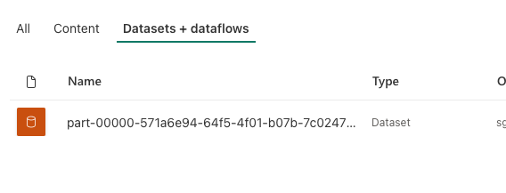
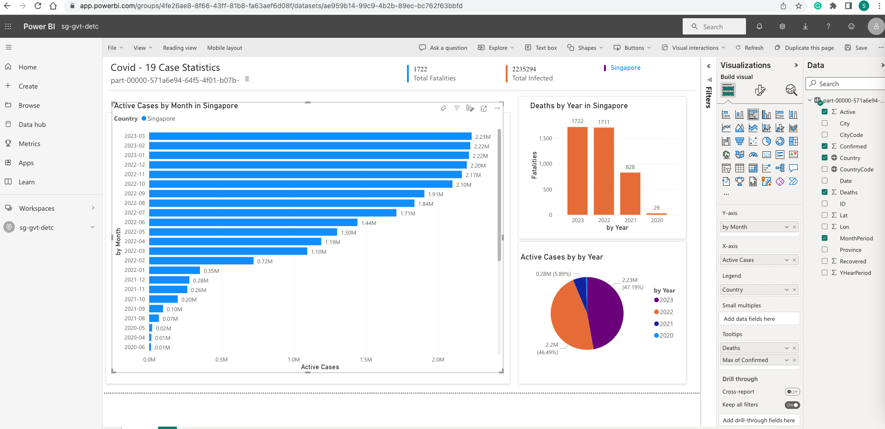
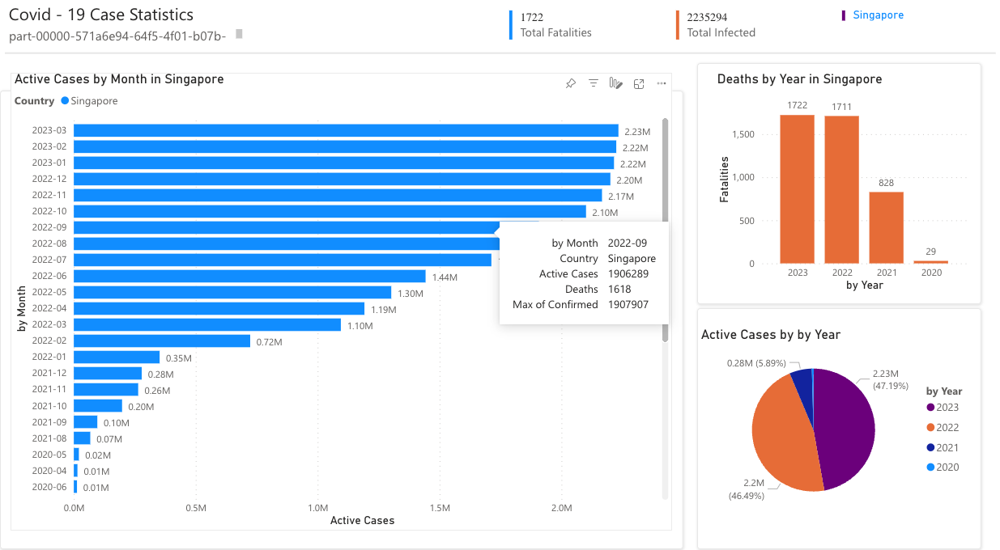

# SECTION 4 - CHARTS & APIs
## Requirement

1. Display a graph to show the number cases in Singapore over time using the APIs from https://covid19api.com/

## Implementation Details
### Get Data Set

1. Execute python code in below path
   -  "section_4_charts_apis/export_rest_api_to_csv.py")
2. The program will 
   - extract the data from rest api call and load it in dataframe
   - Update the dataframe to include MonthPeriod in "yyyy-MM" format and YearPeriod in "yyyy" format
   - generate the final dataset in csv format in below path
     - "section_4_charts_apis/Source_data/csv/part-00000-edc5dc74-a25a-4431-b2c1-4f26332a57ed-c000.csv"

### Load Data in Dashboard

1. For dashboard design I will be using Power BI
2. Upload the CSV file in to Power BI Service website as Dataset

 

### Dashboard Design 
3. Below dashboard was created
   - Designer View
     -  
   - Preview
     -  
